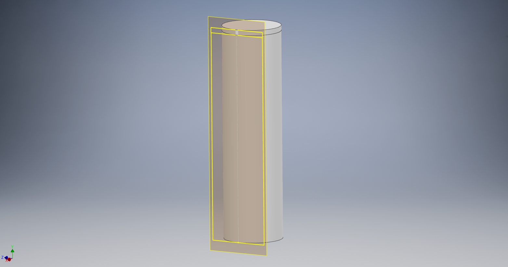
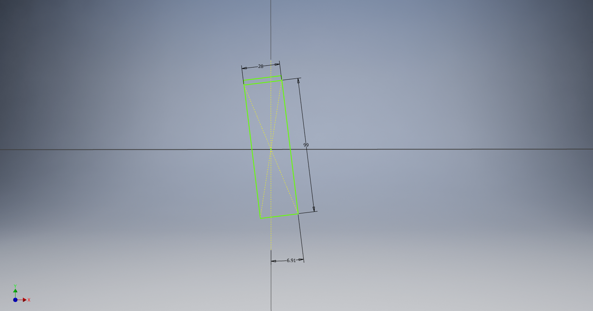
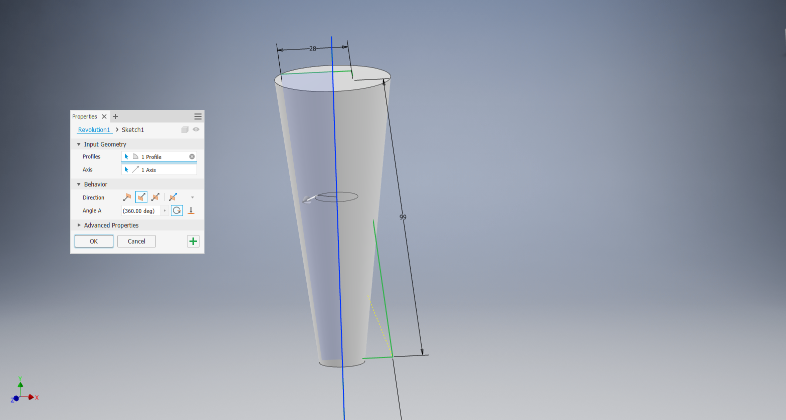
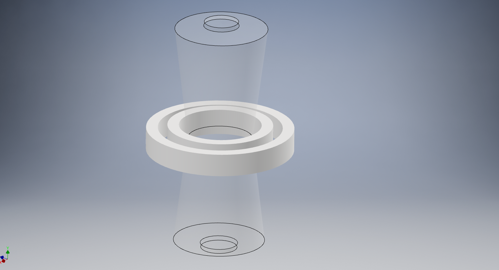

# _How to design a TVC gimbal to prevent collisions_

## Kinematic Reference Volume

This will walk you through designing a kinematic reference volume that you can
use to visualize and verify where the TVC mount will swing at its greatest extent.
Knowing this can allow for better servo placement.

(_Assumes you are using Fusion360, but applicable to other CAD programs_)

1. After designing your motor retainer tube take a side projection of its outline
   

2. Rotate the projection from vertical by the maximum expected deflection
   (in this example 6.91 degrees)
   

3. Use the vertical axis to split the projection, applying a revolve to both halves
   around the same vertical axis
   

4. Set a transparency, and, in the assembly environment, set reference geometry
   to disabled as for this to not interact with your other parts.
   

**Now get out there and design some fresh gimbals!**
